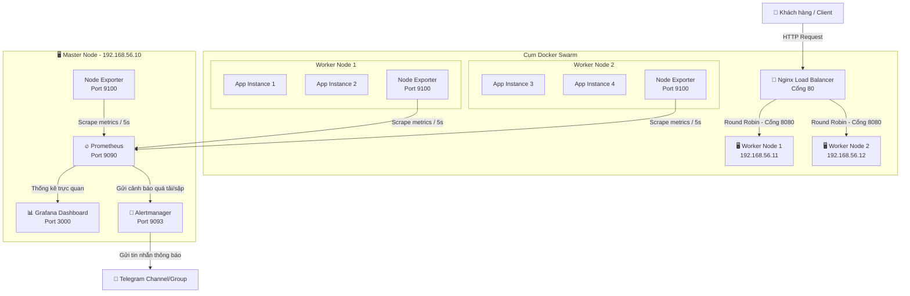

# 📊 High-Availability Multi-Node Cluster with Automated Observability Pipeline

[](https://ubuntu.com/)
[](https://www.docker.com/)
[](https://nginx.org/)
[](https://prometheus.io/)
[](https://grafana.com/)
[](https://telegram.org/)

Một hệ thống hạ tầng mạng phân tán dựa trên kiến trúc **Multi-node** nhằm tối ưu hóa khả năng chịu tải, đảm bảo tính sẵn sàng cao (**High Availability - HA**) và tự phục hồi (**Self-healing**) cho ứng dụng doanh nghiệp. Hệ thống được tích hợp "mắt thần" giám sát chỉ số phần cứng tập trung (**Centralized Monitoring**) và cảnh báo sự cố tự động (**Instant Alerting**) qua Telegram.

---

## 🚀 Tính năng nổi bật

*   **🔒 High Availability (HA) & Self-healing:** Ứng dụng được nhân bản và chạy phân tán trên nhiều máy ảo (Worker Nodes). Hệ thống tự động phát hiện và khôi phục dịch vụ nếu một node gặp sự cố sập nguồn hoặc mất kết nối.
*   **⚖️ Load Balancing:** Sử dụng Nginx làm Reverse Proxy và cân bằng tải giúp phân phối đều lưu lượng truy cập của người dùng đến các node phía sau bằng thuật toán *Round Robin*.
*   **📈 Centralized Monitoring:** Thu thập toàn bộ chỉ số tài nguyên phần cứng (CPU, RAM, Disk, Network) của tất cả các máy ảo về một trung tâm quản lý duy nhất bằng Prometheus & Node Exporter.
*   **🖥️ Visualized Dashboard:** Biểu diễn dữ liệu trực quan bằng các biểu đồ realtime trên Grafana, giúp quản trị viên nắm bắt sức khỏe hệ thống chỉ trong 5 giây.
*   **🚨 Instant Alerting:** Cấu hình Alertmanager chủ động gửi tin nhắn cảnh báo tức thời về Telegram/Discord khi phát hiện server bị quá tải tài nguyên (>80%) hoặc dịch vụ bị sập.

---

## 📐 Kiến trúc hệ thống (System Architecture)

### Sơ đồ luồng hoạt động (Data Flow & Monitoring)



### Sơ đồ khối ASCII

```text
                      [ Khách hàng truy cập ]
                                 │
                                 ▼
                     ┌───────────────────────┐
                     │ Nginx Load Balancer   │
                     └───────────┬───────────┘
                                 │ (Chia tải Round Robin)
                ┌────────────────┴────────────────┐
                ▼                                 ▼
     ┌─────────────────────┐           ┌─────────────────────┐
     │    Worker Node 1    │           │    Worker Node 2    │
     │  ┌───────────────┐  │           │  ┌───────────────┐  │
     │  │ App Container │  │           │  │ App Container │  │
     │  └───────┬───────┘  │           │  └───────┬───────┘  │
     │          │          │           │          │          │
     │  ┌───────▼───────┐  │           │  ┌───────▼───────┐  │
     │  │ Node Exporter │  │           │  │ Node Exporter │  │
     │  └───────┬───────┘  │           │  └───────┬───────┘  │
     └──────────┼──────────┘           └──────────┼──────────┘
                │                                 │
                └───────────────┬─────────────────┘
                                │ (Thu thập Metrics sau mỗi 5s)
                                ▼
                     ┌───────────────────────┐
                     │      Master Node      │
                     │  ┌─────────────────┐  │
                     │  │   Prometheus    │  │
                     │  └────────┬────────┘  │
                     │           ▼           │
                     │  ┌─────────────────┐  │      ┌─────────────────┐
                     │  │     Grafana     │ ─┼────> │ Cảnh báo Tlg/Dc │
                     │  └─────────────────┘  │      └─────────────────┘
                     └───────────────────────┘
```

---

## 🛠️ Công nghệ sử dụng

| Logo | Công cụ / Công nghệ | Vai trò trong hệ thống | Chi tiết kỹ thuật |
| :---: | :--- | :--- | :--- |
|  | **Ubuntu Server** | Hệ điều hành hạ tầng | Bản 20.04/22.04 LTS chạy trên ảo hóa VMware/VirtualBox |
|  | **Docker** | Đóng gói & ảo hóa | Container hóa toàn bộ ứng dụng và observability tools |
|  | **Docker Swarm** | Điều phối Container | Quản lý cụm cluster, tự động mở rộng và tự phục hồi dịch vụ |
|  | **Nginx** | Cân bằng tải & Proxy ngược | Điều phối request người dùng đến các node theo cơ chế Round Robin |
|  | **Prometheus** | Hệ thống giám sát chính | Thu thập và xử lý các số liệu Time-series metric (Scrape interval: 5s) |
|  | **Grafana** | Trực quan hóa dữ liệu | Tạo bảng điều khiển (Dashboard) theo dõi hiệu năng hệ thống trực quan |
|  | **Alertmanager** | Quản lý cảnh báo | Tiếp nhận tín hiệu từ Prometheus và đẩy cảnh báo qua Telegram Bot |
|  | **Bash Scripting** | Kịch bản tự động hóa | Shell scripting chạy các kịch bản stress-test và cài đặt nhanh |

---

## 📂 Cấu trúc thư mục dự án

```text
ha-cluster/
├── infrastructure/
│   ├── docker-compose-app.yml     # Khai báo stack dịch vụ ứng dụng web (4 replicas)
│   └── nginx-loadbalancer.conf    # Cấu hình cân bằng tải và Reverse Proxy cho Nginx
├── monitoring/
│   ├── prometheus.yml             # Cấu hình target giám sát và chu kỳ thu thập metrics
│   ├── alert-rules.yml            # Khai báo các ngưỡng cảnh báo (CPU/RAM/Disk/Node sập)
│   ├── alertmanager.yml           # Cấu hình Telegram Webhook và template tin nhắn
│   ├── grafana-dashboard.json     # Template import nhanh Dashboard giám sát Grafana
│   └── docker-compose-monitor.yml # File chạy cụm công cụ Prometheus, Grafana, Alertmanager
└── README.md                      # Báo cáo tổng quan hệ thống (tài liệu này)
```

---

## 💻 Hướng dẫn triển khai nhanh (Quick Start)

### 1. Chuẩn bị môi trường
*   Cần tối thiểu 3 máy ảo Ubuntu Server đã cài đặt sẵn Docker và giao tiếp mạng được với nhau.
*   **Khởi tạo cụm Swarm trên máy Master (192.168.56.10):**
    ```bash
    docker swarm init --advertise-addr 192.168.56.10
    ```
*   **Gia nhập các máy Worker vào cụm Swarm:** Copy câu lệnh token được sinh ra từ lệnh trên và chạy trên các máy Worker:
    ```bash
    docker swarm join --token <TOKEN_CỦA_BẠN> 192.168.56.10:2377
    ```
*   **Gán nhãn phân vai trò cho các Worker node (chạy trên Master):**
    ```bash
    docker node update --label-add role=worker worker-01
    docker node update --label-add role=worker worker-02
    ```

### 2. Triển khai ứng dụng và hạ tầng giám sát
*   **Clone mã nguồn dự án về máy Master:**
    ```bash
    git clone https://github.com/your-username/your-repo-name.git
    cd your-repo-name
    ```
*   **Triển khai ứng dụng trên cụm Swarm:**
    ```bash
    docker stack deploy -c infrastructure/docker-compose-app.yml my_app
    ```
*   **Khởi chạy Node Exporter trên cả 3 VM (để thu thập metrics hệ thống):**
    ```bash
    docker run -d \
      --name node-exporter \
      --restart always \
      --net host \
      --pid host \
      -v "/:/host:ro,rslave" \
      prom/node-exporter:latest \
      --path.rootfs=/host
    ```
*   **Khởi chạy hệ thống giám sát tập trung (Prometheus, Grafana, Alertmanager):**
    *   *Lưu ý:* Cập nhật đúng `bot_token` và `chat_id` của bạn trong file `monitoring/alertmanager.yml` trước khi chạy.
    ```bash
    docker compose -f monitoring/docker-compose-monitor.yml up -d
    ```

### 3. Kiểm tra kết quả ban đầu
*   **Ứng dụng Web:** Truy cập qua IP của Nginx Load Balancer tại cổng HTTP: `http://<LB-IP>:80`
*   **Grafana Dashboard:** Truy cập tại địa chỉ `http://<MASTER-IP>:3000` (Tài khoản mặc định: `admin` / `admin123`) để cấu hình Prometheus Data Source và import file `monitoring/grafana-dashboard.json`.

---

## 🧪 Kịch bản kiểm thử toàn diện (Testing Cases)

> [!NOTE]
> Để chứng minh hệ thống hoạt động đúng thiết kế, bạn có thể thực hiện 3 bài test thực tế dưới đây.

### Case 1: Kiểm thử Cân bằng tải (Load Balancing)
Gửi liên tiếp 10 request từ máy ngoài đến địa chỉ IP của Nginx Load Balancer để kiểm tra thuật toán phân phối tải *Round Robin*:
```bash
for i in {1..10}; do curl -s http://192.168.56.10 | grep "Hello from Container"; done
```
*Yêu cầu:* Response trả về chứa các ID Container khác nhau được luân phiên đều đặn từ các máy Worker.

### Case 2: Kiểm thử tính sẵn sàng cao & Tự phục hồi (High Availability & Self-healing)
1.  Xem trạng thái phân phối container hiện tại:
    ```bash
    docker service ps my_app_webapp
    ```
2.  Mô phỏng sập nguồn bằng cách **Tắt nguồn đột ngột (Power Off)** máy ảo `worker-02`.
3.  Theo dõi quá trình tự động điều phối trên máy Master:
    ```bash
    docker service ps my_app_webapp
    ```
*Yêu cầu:* Docker Swarm tự phát hiện `worker-02` ngoại tuyến và lập tức tái tạo các container bị mất sang `worker-01` để đảm bảo hệ thống luôn có đủ 4 bản sao chạy ổn định.

### Case 3: Kiểm thử Cảnh báo Tài nguyên & Sập Node qua Telegram
1.  **Cảnh báo CPU cao (>80%):** SSH vào máy `worker-01` và giả lập stress tải CPU:
    ```bash
    sudo apt install -y stress
    stress --cpu 4 --timeout 120s
    ```
    *Kết quả:* Prometheus phát hiện tài nguyên quá ngưỡng trong 2 phút -> Alertmanager trigger -> Gửi tin nhắn cảnh báo đỏ `🔴 CẢNH BÁO: HighCpuUsage` về Group Telegram. Khi stress dừng, nhận tiếp tin nhắn màu xanh `🟢 ĐÃ PHỤC HỒI`.
2.  **Cảnh báo Node Down:** Tắt dịch vụ Node Exporter trên Worker 2:
    ```bash
    docker stop node-exporter
    ```
    *Kết quả:* Trong vòng 30 giây, Telegram sẽ nhận cảnh báo `🔴 CẢNH BÁO: NodeDown`. Khi khởi động lại dịch vụ (`docker start node-exporter`), hệ thống tự động gửi tin nhắn `🟢 ĐÃ PHỤC HỒI`.

---

## 📸 Hình ảnh Demo thực tế

Dưới đây là một số hình ảnh chứng minh hệ thống vận hành thực tế trong môi trường ảo hóa:

### 1. Giao diện Giám sát trực quan trên Grafana
> *Bảng điều khiển biểu thị lưu lượng mạng, dung lượng ổ đĩa, lượng RAM tiêu thụ và phần trăm CPU thời gian thực.*
>  *(Vui lòng cập nhật hình ảnh chụp màn hình Grafana thực tế của bạn tại thư mục screenshots)*

### 2. Tin nhắn cảnh báo tự động về Telegram
> *Hệ thống Alertmanager tự động thông báo trạng thái lỗi (firing) và khôi phục (resolved) trực tiếp về nhóm chat Telegram.*
>  *(Vui lòng cập nhật hình ảnh chụp màn hình tin nhắn Telegram thực tế của bạn tại thư mục screenshots)*

---

## ⚙️ Các lỗi thường gặp & Cách khắc phục

| Sự cố phát sinh | Nguyên nhân chủ yếu | Cách xử lý / Khắc phục |
| :--- | :--- | :--- |
| Worker không join được Swarm | Firewall (UFW) trên Master chặn cổng kết nối Swarm | Chạy `sudo ufw allow 2377/tcp` trên Master |
| Prometheus target báo DOWN | Node Exporter chưa khởi chạy hoặc cổng 9100 bị chặn | Chạy `docker ps` kiểm tra container. Mở port: `sudo ufw allow 9100/tcp` |
| Grafana báo lỗi kết nối Prometheus | Nhập sai URL của data source Prometheus | Sử dụng `http://prometheus:9090` (tên dịch vụ Docker, không dùng localhost) |
| Không nhận được Alert trên Telegram | Cấu hình sai Token của Bot hoặc Chat ID | Kiểm tra lại thông tin cấu hình qua API của Telegram: `https://api.telegram.org/bot<BOT_TOKEN>/getUpdates` |
| Container không tự phục hồi khi node sập | Chưa cấu hình `restart_policy` trong Docker Compose | Đảm bảo phần cấu hình `deploy` có chứa `condition: on-failure` |
| Nginx báo lỗi 502 Bad Gateway | Các ứng dụng ở Worker Node chưa sẵn sàng hoặc Nginx sai IP Worker | Kiểm tra trạng thái container bằng `docker service ps` và kiểm tra lại file `nginx-loadbalancer.conf` |

---

## 📚 Tài liệu tham khảo

*   [Docker Swarm Orchestration Guide](https://docs.docker.com/engine/swarm/)
*   [Prometheus Querying & Monitoring Documentation](https://prometheus.io/docs/)
*   [Grafana Visualization Tools](https://grafana.com/docs/)
*   [Alertmanager Telegram Config Specs](https://prometheus.io/docs/alerting/latest/configuration/#telegram_config)
*   [Nginx HTTP Load Balancing](https://docs.nginx.com/nginx/admin-guide/load-balancer/http-load-balancer/)
