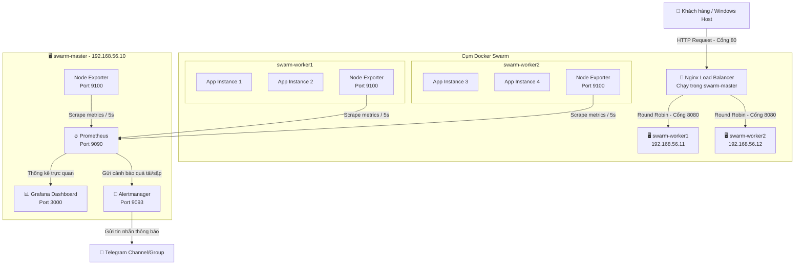

# 📊 High-Availability Multi-Node Cluster with Automated Observability Pipeline (DinD Edition)

[](https://hub.docker.com/_/docker)
[](https://www.docker.com/)
[](https://nginx.org/)
[](https://prometheus.io/)
[](https://grafana.com/)
[](https://telegram.org/)

Một hệ thống hạ tầng mạng phân tán dựa trên kiến trúc **Multi-node** nhằm tối ưu hóa khả năng chịu tải, đảm bảo tính sẵn sàng cao (**High Availability - HA**) và tự phục hồi (**Self-healing**) cho ứng dụng doanh nghiệp. Hệ thống được triển khai giả lập bằng **Docker-in-Docker (DinD)** cực kỳ nhẹ nhàng và tích hợp hệ thống giám sát tập trung (**Centralized Monitoring**) kèm cảnh báo sự cố tự động (**Instant Alerting**) qua Telegram.

---

## 🚀 Tính năng nổi bật

*   **🔒 High Availability (HA) & Self-healing:** Ứng dụng được nhân bản thành 4 bản sao chạy phân tán trên các Worker Nodes. Hệ thống tự động phát hiện và khôi phục dịch vụ nếu một node gặp sự cố sập hoặc ngắt kết nối.
*   **⚖️ Load Balancing:** Sử dụng Nginx làm Load Balancer giúp phân phối đều lưu lượng truy cập của người dùng đến các node phía sau bằng thuật toán *Round Robin*.
*   **📈 Centralized Monitoring:** Thu thập toàn bộ chỉ số tài nguyên phần cứng (CPU, RAM, Disk, Network) của tất cả các node ảo về một trung tâm quản lý duy nhất bằng Prometheus & Node Exporter.
*   **🖥️ Visualized Dashboard:** Biểu diễn dữ liệu trực quan bằng các biểu đồ realtime trên Grafana, giúp quản trị viên nắm bắt sức khỏe hệ thống chỉ trong vài giây.
*   **🚨 Instant Alerting:** Cấu hình Alertmanager chủ động gửi tin nhắn cảnh báo tức thời về Telegram khi phát hiện server bị quá tải tài nguyên (>80%) hoặc dịch vụ bị sập.

---

## 📐 Kiến trúc hệ thống (System Architecture)

### Sơ đồ luồng hoạt động (Data Flow & Monitoring)



---

## 📂 Cấu trúc thư mục dự án

```text
ha-cluster/
├── infrastructure/
│   ├── docker-compose-app.yml     # Khai báo stack dịch vụ ứng dụng web (4 replicas)
│   └── nginx-loadbalancer.conf    # Cấu hình cân bằng tải và Reverse Proxy cho Nginx
├── monitoring/
│   ├── prometheus.yml             # Cấu hình target giám sát và chu kỳ thu thập metrics
│   ├── alert-rules.yml            # Khai báo các ngưỡng cảnh báo (CPU/RAM/Disk/Node sập)
│   ├── alertmanager.yml           # Cấu hình Telegram Webhook và template tin nhắn
│   └── docker-compose-monitor.yml # File chạy cụm công cụ Prometheus, Grafana, Alertmanager
├── progress-tracker.md            # Nhật ký lưu tiến độ thực hiện
└── README.md                      # Báo cáo tổng quan hệ thống (tài liệu này)
```

---

## 💻 Hướng dẫn triển khai (Quick Start)

### 1. Khởi tạo mạng và các máy ảo Container (DinD)
Chạy trên Windows PowerShell:
```powershell
# Tạo mạng ảo
docker network create --subnet 192.168.56.0/24 swarm-network

# Khởi chạy 3 node
docker run -d --privileged --name swarm-master --hostname swarm-master --network swarm-network --ip 192.168.56.10 -p 80:80 -p 3000:3000 -p 9090:9090 docker:dind
docker run -d --privileged --name swarm-worker1 --hostname swarm-worker1 --network swarm-network --ip 192.168.56.11 docker:dind
docker run -d --privileged --name swarm-worker2 --hostname swarm-worker2 --network swarm-network --ip 192.168.56.12 docker:dind
```

### 2. Thiết lập cụm Docker Swarm
```powershell
# Khởi tạo Swarm trên Master
docker exec -it swarm-master docker swarm init --advertise-addr 192.168.56.10

# Cho các Worker join vào Swarm (Sử dụng Token được sinh ra ở lệnh trên)
docker exec -it swarm-worker1 docker swarm join --token <YOUR_TOKEN> 192.168.56.10:2377
docker exec -it swarm-worker2 docker swarm join --token <YOUR_TOKEN> 192.168.56.10:2377

# Gán nhãn vai trò cho các worker
docker exec -it swarm-master docker node update --label-add role=worker swarm-worker1
docker exec -it swarm-master docker node update --label-add role=worker swarm-worker2
```

### 3. Đồng bộ cấu hình và Triển khai Ứng dụng Web
```powershell
# Copy code từ Windows vào Master Container
docker cp infrastructure swarm-master:/infrastructure

# Deploy Stack ứng dụng lên cụm Swarm
docker exec -it swarm-master docker stack deploy -c /infrastructure/docker-compose-app.yml my_app

# Khởi chạy Nginx Load Balancer trên Master
docker exec -it swarm-master docker run -d --name nginx-lb -p 80:80 -v /infrastructure/nginx-loadbalancer.conf:/etc/nginx/conf.d/default.conf nginx:alpine
```

### 4. Triển khai Hệ thống giám sát (Observability Pipeline)
*   *Lưu ý:* Cập nhật đúng `bot_token` và `chat_id` của bạn trong file `monitoring/alertmanager.yml` trên Windows trước khi chạy lệnh copy.
```powershell
# Khởi chạy Node Exporter trên cả 3 node để thu thập metrics
docker exec -d swarm-master docker run -d --name node-exporter --restart always --net host --pid host -v "/:/host:ro,rslave" prom/node-exporter:latest --path.rootfs=/host
docker exec -d swarm-worker1 docker run -d --name node-exporter --restart always --net host --pid host -v "/:/host:ro,rslave" prom/node-exporter:latest --path.rootfs=/host
docker exec -d swarm-worker2 docker run -d --name node-exporter --restart always --net host --pid host -v "/:/host:ro,rslave" prom/node-exporter:latest --path.rootfs=/host

# Đồng bộ thư mục giám sát vào Master
docker cp monitoring swarm-master:/monitoring

# Khởi chạy cụm Prometheus, Grafana, Alertmanager
docker exec -it swarm-master sh -c "cd /monitoring && docker compose -f docker-compose-monitor.yml up -d"
```

---

## 🧪 Kịch bản kiểm thử toàn diện (Testing Cases)

### Case 1: Kiểm thử Cân bằng tải (Load Balancing)
Gửi liên tiếp 10 request từ trình duyệt máy thật truy cập địa chỉ `http://localhost` hoặc chạy lệnh sau trong PowerShell:
```powershell
for ($i=1; $i -le 10; $i++) { curl -s http://localhost | select -first 1 }
```

### Case 2: Kiểm thử tính sẵn sàng cao & Tự phục hồi (High Availability & Self-healing)
1.  Xem trạng thái phân phối ban đầu:
    ```powershell
    docker exec -it swarm-master docker service ps my_app_webapp
    ```
2.  Mô phỏng sập node bằng cách **Tắt container `swarm-worker2`**:
    ```powershell
    docker stop swarm-worker2
    ```
3.  Theo dõi quá trình tự động điều phối trên máy Master:
    ```powershell
    docker exec -it swarm-master docker service ps my_app_webapp
    ```
    *Yêu cầu:* Docker Swarm tự phát hiện `swarm-worker2` ngoại tuyến và lập tức tái tạo các container bị mất sang `swarm-worker1` để luôn đảm bảo có đủ 4 bản sao.

### Case 3: Kiểm thử Cảnh báo sập Node (Node Down Alert)
1.  Truy cập vào giao diện quản lý Alerts của Prometheus tại: `http://localhost:9090/alerts`
2.  Tắt Node Exporter trên Worker 1:
    ```powershell
    docker exec -it swarm-worker1 docker stop node-exporter
    ```
3.  *Kết quả:* Trong vòng 30 giây, Alert rule `NodeDown` trên giao diện Prometheus sẽ chuyển sang màu đỏ (`FIRING`) và Alertmanager gửi ngay tin nhắn cảnh báo 🔴 về Telegram. Khi khởi động lại dịch vụ (`docker exec -it swarm-worker1 docker start node-exporter`), hệ thống tự động gửi tin nhắn 🟢 để thông báo phục hồi.
